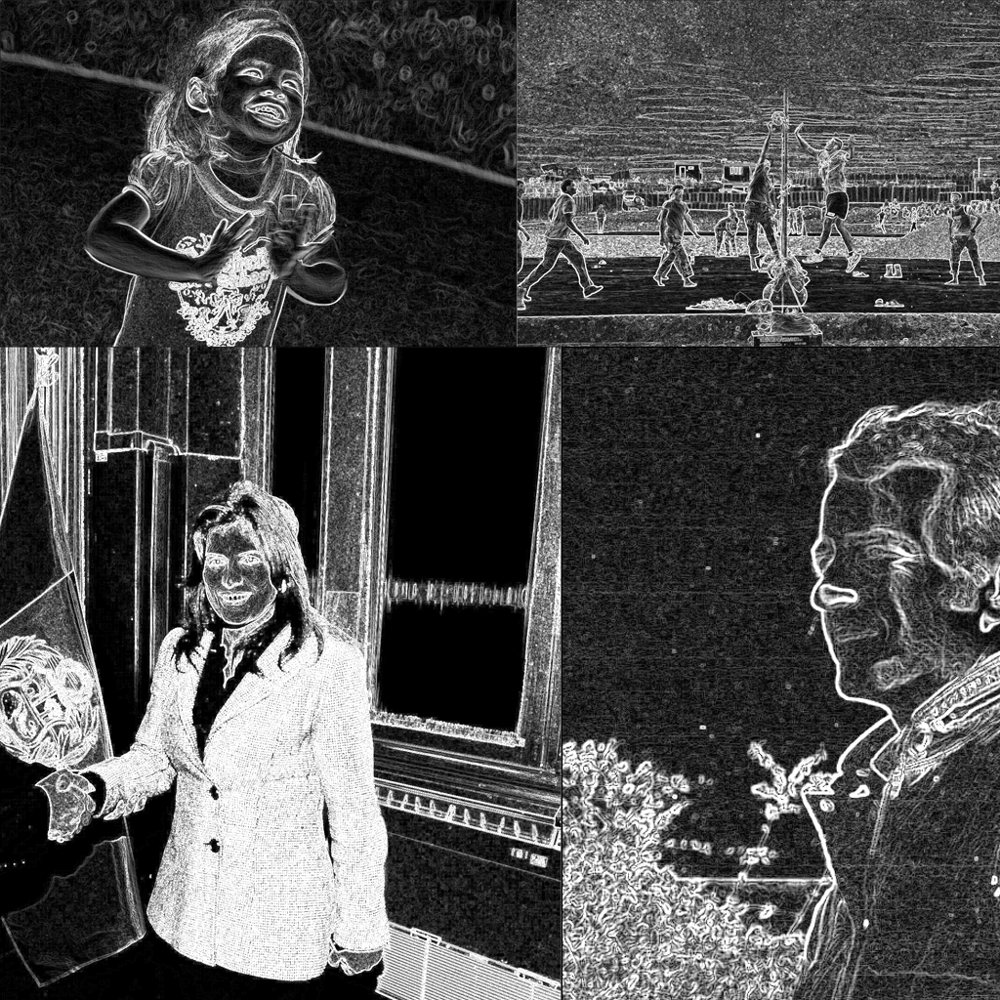

# Datos de la máquina
Procesador: AMD Ryzen 9 5900X 12-Core Proceessor (24 CPUs),~3.7GHz

Memoria RAM: 32768MB

GPU: NVIDIA GeForce RTX 3070

# Datos recopilados

|N                           | Tiempo Secuencial (s) | Tiempo Paralelo 24 hilos (s) | Tiempo Paralelo 48 hilos (s) |
|----------------------------|-----------------------|------------------------------|------------------------------|
|1                           | 22.78                 | 19.83 🔴                     | 19.98 🔴                    |
|2                           | 22.76                 | 19.38                        | 19.06                        |
|3                           | 23.27                 | 19.17  🔴                    | 19.02 🔴                    |
|4                           | 23.15 🔴              | 19.73                        | 19.41                        |
|5                           | 22.15 🔴              | 19.76                        | 19.27                        |
|Promedio (eliminando peores)| 22.94                 | 19.62                        | 19.25                        |


# Speedup

|Speedup 24 hilos|Speedup 48 hilos|
|----------------|----------------|
|1.17            |1.19            |

# Discusión

Los speedup obtenidos para 24 hilos y 48 hilos, fueron 117% y 119% respectivamente, hubo una mejora significativa, pero al utilizar el doble de hilos la mejora fue del  1.7% entre ellas.

Esto quiere decir o según lo que logro analizar: El algoritmo probablemente no se beneficia de una mayor cantidad de hilos. Según lo que entendí sobre **Numba** este tipo de operaciones se ven mejor reflejadas si son realizadas por la **GPU**, en nuestro caso estamos utilizando la **CPU** para ello. Además sería bueno revizar el algoritmo para encontrar en donde está haciendo operaciones de sincronización ya que esto podría desbalancear la carga de éste.

# Funciones realizadas

Se modificó all.sh para que pudiera leer las imagenes utilizando un for. Las imagenes las ordené guardandolas en el archivo images-png (también se creo un script en python que transforma las imagenes jpg a png por si las moscas).
```
for INPUT_PNG in ${IMAGE_DIR}/*.png; do
   
    BASENAME=$(basename "${INPUT_PNG}" .png)
    TEMP_FILE="${BASENAME}.bin"
    
    python3 fromPNG2Bin.py "${INPUT_PNG}"

    ./main "${TEMP_FILE}"
    
    python3 fromBin2PNG.py "${TEMP_FILE}.new"

done
```
Para la ejecución del código se modificó el Makefile para ejecutar OpenMP
```
compile:
	gcc -fopenmp -o main main.c
```

Luego en el main.c se agregó el número de hilos se incluyó OpenMP y se seteo el número de hilos.
```
#include <omp.h>  //openmp
// Definir el número de hilos como una variable global
int NUM_THREADS = 48;  // numero de hilos

int main(int argc, char* argv[]) {
    ...
    // Configuración de los hilos
    omp_set_num_threads(NUM_THREADS);
    ...
}
```
Por ultimo se utilizó el pragma para comenzar a paralelizar lo deseado
```
    // Paralelizar el bucle externo que recorre las filas de la imagen usando OpenMP.
    #pragma omp parallel for shared(imagen, imagenProcesada, width, height, Gx, Gy)
    for (int y = 1; y < height - 1; y++) {
        for (int x = 1; x < width - 1; x++) {
            int sumX = 0;
            int sumY = 0;

            // Aplicar máscaras de Sobel (Gx y Gy)
            for (int ky = -1; ky <= 1; ky++) {
                for (int kx = -1; kx <= 1; kx++) {
                    sumX += imagen[(y + ky) * width + (x + kx)] * Gx[ky + 1][kx + 1];
                    sumY += imagen[(y + ky) * width + (x + kx)] * Gy[ky + 1][kx + 1];
                }
            }

            // Calcular magnitud del gradiente
            int magnitude = abs(sumX) + abs(sumY);
            imagenProcesada[y * width + x] = (magnitude > 255) ? 255 : magnitude;  // Normalizar a 8 bits
        }
    }

    #pragma omp parallel for reduction(+:suma) 
    for (int i = 0; i < width * height; i++) {
        suma += imagen[i];
    }
```

# Modificaciones al código

Se encuentra de que el codigo dado está implementado para imagenes de 1024 x 1024 pixeles (restrictivamente), por lo que al modificarlo para las imagenes solicitadas en el parcial no es posible renderizar las imagenes con el filtro aplicado de manera correcta. Así que se procede a modificar los factores que dan el tamaño de las imagenes para que puedan ser procesadas correctamente.

# fromPNG2Bin.py
```
# se agrega el dinamismo en el tamanio tanto para ancho como para largo
width, height = imagen.size  # Obtener dimensiones dinámicas

# Convertir la imagen a un array de NumPy
array_imagen = np.array(imagen)

# Guardar ancho y alto como int32 al inicio del archivo binario
with open(OUTPUT_FILE, 'wb') as f:
    np.int32(width).tofile(f)
    np.int32(height).tofile(f)
    array_imagen.astype('int32').tofile(f)
```
Puesto que ahora el archivo binario creado va a contener el tamaño de la imagen (widht, height), procedemos a que el código en C lo lea.

# main.c
```
    // Leer ancho y alto
    fread(&width, sizeof(int), 1, archivo);
    fread(&height, sizeof(int), 1, archivo);
```

# fromBin2PNG.py
Luego hacemos lo mismo para convertir de Bin a PNG capturando los valores de widht y height del binario para convertir el bin a PNG

```
with open(INPUT_FILE, 'rb') as f:
    # Leer ancho y alto
    width = np.fromfile(f, dtype='int32', count=1)[0]
    height = np.fromfile(f, dtype='int32', count=1)[0]
    
    # Leer los datos de los píxeles
    array_imagen = np.fromfile(f, dtype='int32').reshape((height, width))
```
# Ejemplo


